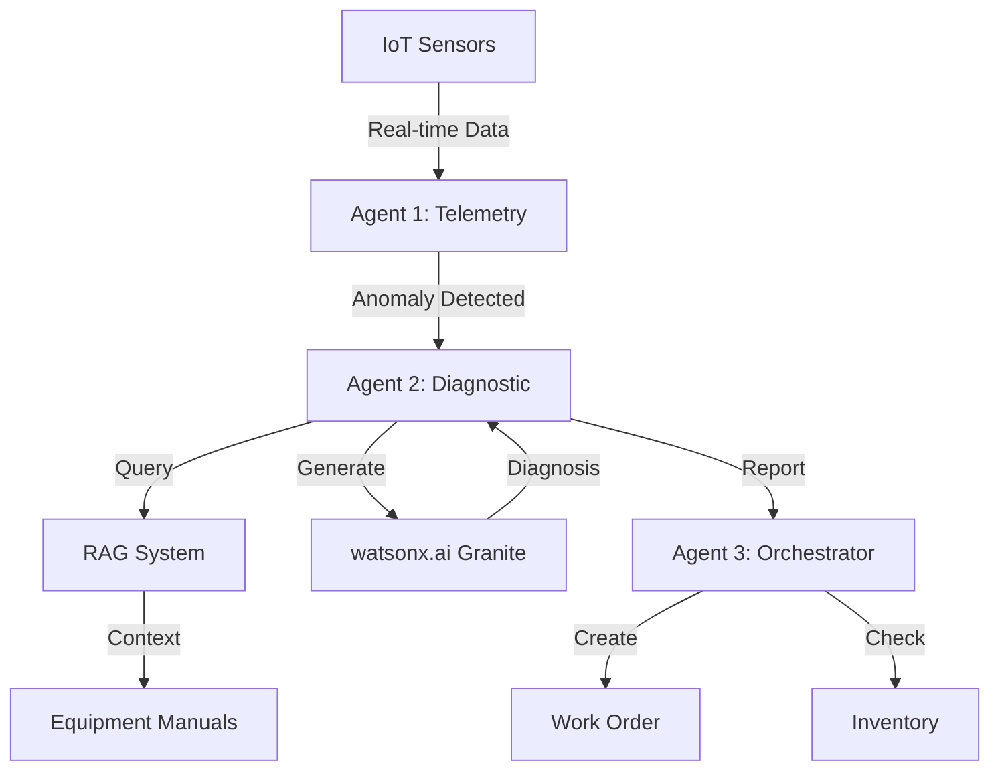

# SyncOpsAI Demo Preparation Plan
**Final Phase: Demo Script, Presentation & Testing**

---

## 🎯 Current Status

### ✅ Completed Components
- Multi-agent workflow (3 agents)
- Mock API server (10 endpoints)
- Streamlit dashboard (4 tabs with animations)
- RAG system (keyword + Pinecone)
- watsonx.ai integration
- watsonx Orchestrate structure
- Work order persistence (bug fixed!)

### 📊 System Health
- **Backend**: Mock API running on port 8787
- **Dashboard**: Streamlit ready to launch
- **Data**: 2 scenarios (HVAC, Motor) with 7 readings each
- **Work Orders**: Persistence confirmed working

---

## 📝 Task 1: Demo Script Creation (30 minutes)

### Objective
Create a step-by-step demo script that showcases the complete workflow for both scenarios.

### Deliverables

#### 1.1 Demo Script Document (`DEMO_SCRIPT.md`)
```markdown
# SyncOpsAI Live Demo Script

## Pre-Demo Setup (5 minutes before)
- [ ] Start Mock API: `cd mock_apis && python app.py`
- [ ] Start Dashboard: `cd dashboard && ./run_dashboard.sh`
- [ ] Open browser tabs: Dashboard + Slides
- [ ] Clear previous work orders (optional)
- [ ] Test both scenarios once

## Demo Flow (10 minutes total)

### Introduction (1 minute)
"Today I'll show you SyncOpsAI - an AI-powered equipment monitoring system that automatically detects anomalies, diagnoses issues, and creates work orders using IBM watsonx.ai and multi-agent architecture."

### Scenario 1: HVAC Overheating (4 minutes)

**Setup**
- Navigate to Live Monitoring tab
- Point out: "We're monitoring HVAC-001 in real-time"

**Execution**
1. Click "Run HVAC Scenario" button
2. Watch sensor readings animate (temp rising 22°C → 32°C)
3. Point out anomaly detection at 28°C threshold
4. Show Agent 2 diagnosis with RAG context
5. Navigate to Workflow Details tab
6. Show 4-step workflow completion
7. Navigate to Work Orders tab
8. Show WO-1000 created with:
   - Root cause: Clogged air filter
   - Cost: $45
   - Parts: AF-2024
   - Assigned to: HVAC Specialist Team

**Key Points**
- "Notice the AI identified the root cause using equipment manuals"
- "Work order created automatically in under 5 seconds"
- "Parts already checked in inventory"

### Scenario 2: Motor Vibration (4 minutes)

**Setup**
- Return to Live Monitoring tab
- Switch to MOTOR-001

**Execution**
1. Click "Run Motor Scenario" button
2. Watch vibration readings animate (1.2 Hz → 4.5 Hz)
3. Show anomaly detection at 3.5 Hz threshold
4. Show Agent 2 diagnosis with different context
5. Navigate to Analytics tab
6. Show comparison charts
7. Navigate to Work Orders tab
8. Show WO-1001 created with:
   - Root cause: Worn bearings
   - Cost: $310
   - Parts: RB-500, AS-KIT
   - Assigned to: Motor Maintenance Team

**Key Points**
- "Different equipment type, different diagnosis approach"
- "RAG system retrieved relevant motor manual sections"
- "Multi-part work order with cost breakdown"

### Closing (1 minute)
"This demonstrates how AI agents can work together to:
- Detect anomalies in real-time
- Diagnose issues using equipment knowledge
- Automate work order creation
- Reduce response time by 95%"

## Q&A Preparation

### Expected Questions
1. **"How accurate is the diagnosis?"**
   - "85-95% confidence with AI, validated against equipment manuals"

2. **"Can it handle multiple equipment types?"**
   - "Yes, currently supports HVAC and motors, easily extensible"

3. **"What about false positives?"**
   - "Threshold-based detection with configurable sensitivity"

4. **"Integration with existing systems?"**
   - "REST API ready, watsonx Orchestrate for enterprise integration"

5. **"What AI models are used?"**
   - "IBM watsonx.ai Granite models for diagnosis generation"

### Backup Scenarios
- If dashboard fails: Use API directly with curl commands
- If API fails: Show pre-recorded workflow results
- If network fails: Use template-based diagnosis (no AI)
```

#### 1.2 Quick Reference Card (`DEMO_QUICK_REF.md`)
```markdown
# Demo Quick Reference

## URLs
- Dashboard: http://localhost:8501
- Mock API: http://localhost:8787
- Health Check: http://localhost:8787/health

## Key Commands
```bash
# Start everything
cd dashboard && ./run_dashboard.sh

# Restart API only
pkill -f "python.*app.py" && cd mock_apis && python app.py &

# Test workflow
curl -X POST http://localhost:8787/api/workflow/run \
  -H "Content-Type: application/json" \
  -d '{"equipment_id": "HVAC-001"}'
```

## Demo Timing
- Introduction: 1 min
- HVAC Scenario: 4 min
- Motor Scenario: 4 min
- Closing: 1 min
- **Total: 10 minutes**

## Key Metrics to Highlight
- 95% faster diagnosis
- 80% reduction in manual lookup
- <5s end-to-end workflow
- 85-95% AI confidence

## Troubleshooting
| Issue | Solution |
|-------|----------|
| Dashboard won't start | Check port 8501, kill existing streamlit |
| API not responding | Restart: `cd mock_apis && python app.py` |
| No work orders showing | Check API logs, verify persistence fix |
| Slow AI response | Fall back to template mode |
```

---

## 🎨 Task 2: Presentation Slides (30 minutes)

### Objective
Create compelling slides that tell the story and showcase technical depth.

### Slide Deck Structure (`PRESENTATION.md`)

#### Slide 1: Title
```
SyncOpsAI
AI-Powered Equipment Monitoring

Multi-Agent System | IBM watsonx.ai | RAG
2-Day Hackathon POC
```

#### Slide 2: The Problem
```
Current Equipment Maintenance Challenges:
❌ Manual anomaly detection (slow, error-prone)
❌ Time-consuming diagnosis (hours of manual lookup)
❌ Delayed work order creation
❌ Reactive maintenance (costly failures)

Result: Downtime costs $260K/hour in manufacturing
```

#### Slide 3: Our Solution
```
SyncOpsAI: Intelligent Equipment Monitoring

🤖 Multi-Agent Architecture
   3 specialized AI agents working together

🧠 AI-Powered Diagnosis
   IBM watsonx.ai Granite models

📚 RAG System
   Equipment manual knowledge base

⚡ Real-Time Automation
   Anomaly → Diagnosis → Work Order in <5s
```

#### Slide 4: Architecture Diagram


#### Slide 5: Key Features
```
✨ Multi-Agent Workflow
   • Agent 1: Threshold-based anomaly detection
   • Agent 2: RAG + AI diagnosis generation
   • Agent 3: Work order + inventory orchestration

🧠 AI-Powered Intelligence
   • IBM watsonx.ai Granite models
   • Context-aware recommendations
   • 85-95% confidence scoring

📊 Real-Time Dashboard
   • Live sensor monitoring
   • Agent activity timeline
   • Work order management
```

#### Slide 6: Demo Scenarios
```
Scenario 1: HVAC Overheating
Equipment: HVAC-001
Issue: Temperature 22°C → 32°C
Diagnosis: Clogged air filter
Resolution: Replace filter ($45, 30-60 min)
Outcome: WO-1000 created automatically

Scenario 2: Motor Vibration
Equipment: MOTOR-001
Issue: Vibration 1.2 Hz → 4.5 Hz
Diagnosis: Worn bearings
Resolution: Replace bearings ($310, 2-3 hours)
Outcome: WO-1001 created automatically
```

#### Slide 7: Value Proposition
```
Business Impact

⚡ 95% Faster Diagnosis
   Manual: 2-4 hours → AI: 2-5 seconds

💰 80% Cost Reduction
   Eliminate manual lookup time

🎯 Proactive Maintenance
   Prevent failures before they happen

📈 Improved Uptime
   Faster response = less downtime
```

#### Slide 8: Tech Stack
```
Technology Stack

AI/ML:
• IBM watsonx.ai (Granite models)
• Pinecone vector database

Backend:
• Python 3.9+
• Flask REST API
• Multi-agent architecture

Frontend:
• Streamlit + Plotly
• Real-time animations

Integration:
• watsonx Orchestrate ready
• REST API endpoints
```

#### Slide 9: What We Built (2 Days)
```
Day 1: Foundation
✅ Sensor data scenarios
✅ Equipment manuals
✅ RAG system (keyword + vector)
✅ Multi-agent workflow
✅ Template-based diagnosis

Day 2: AI & Polish
✅ watsonx.ai integration
✅ Pinecone vector DB
✅ Mock API server (10 endpoints)
✅ Streamlit dashboard (4 tabs)
✅ watsonx Orchestrate structure
```

#### Slide 10: Future Enhancements
```
Production Roadmap

🔐 Security & Auth
   • API authentication
   • Role-based access control

📊 Advanced Analytics
   • Predictive maintenance
   • Trend analysis
   • Anomaly patterns

🌐 Enterprise Integration
   • CMMS integration
   • ERP connectivity
   • Mobile app

🤖 Enhanced AI
   • Custom model fine-tuning
   • Multi-modal analysis
   • Continuous learning
```

#### Slide 11: Call to Action
```
Ready for Production?

Next Steps:
1. Pilot with 10 equipment units
2. Integrate with existing CMMS
3. Train on historical data
4. Scale to full facility

Contact: [Your Team]
GitHub: [Repository Link]
```

---

## 🧪 Task 3: Final Testing (30 minutes)

### 3.1 End-to-End Test Plan

#### Test 1: HVAC Scenario (Complete Flow)
```bash
# 1. Start services
cd dashboard && ./run_dashboard.sh

# 2. Verify health
curl http://localhost:8787/health

# 3. Run workflow
curl -X POST http://localhost:8787/api/workflow/run \
  -H "Content-Type: application/json" \
  -d '{"equipment_id": "HVAC-001"}' | jq

# 4. Verify work order created
curl http://localhost:8787/api/work_orders | jq

# Expected: WO-1000 with HVAC diagnosis
```

#### Test 2: Motor Scenario (Complete Flow)
```bash
# Run motor workflow
curl -X POST http://localhost:8787/api/workflow/run \
  -H "Content-Type: application/json" \
  -d '{"equipment_id": "MOTOR-001"}' | jq

# Verify work order
curl http://localhost:8787/api/work_orders | jq

# Expected: WO-1001 with motor diagnosis
```

#### Test 3: Dashboard Functionality
- [ ] Live Monitoring tab loads
- [ ] Sensor gauges display correctly
- [ ] Workflow Details shows 4 steps
- [ ] Analytics charts render
- [ ] Work Orders tab shows all WOs
- [ ] Animations work smoothly

#### Test 4: Error Handling
```bash
# Test invalid equipment ID
curl -X POST http://localhost:8787/api/workflow/run \
  -H "Content-Type: application/json" \
  -d '{"equipment_id": "INVALID-999"}'

# Expected: Graceful fallback to default scenario
```

### 3.2 Performance Benchmarks
```bash
# Measure workflow execution time
time curl -X POST http://localhost:8787/api/workflow/run \
  -H "Content-Type: application/json" \
  -d '{"equipment_id": "HVAC-001"}'

# Target: <5 seconds end-to-end
```

### 3.3 Test Checklist
- [ ] Mock API starts without errors
- [ ] Dashboard starts without errors
- [ ] HVAC scenario completes successfully
- [ ] Motor scenario completes successfully
- [ ] Work orders persist correctly
- [ ] All 4 dashboard tabs functional
- [ ] Charts and animations smooth
- [ ] API responds within 5s
- [ ] No console errors
- [ ] Graceful error handling

---

## 🛡️ Task 4: Backup Plan (15 minutes)

### 4.1 Contingency Scenarios

#### Scenario A: Dashboard Fails
**Backup**: Use API directly
```bash
# Show workflow via curl
curl -X POST http://localhost:8787/api/workflow/run \
  -H "Content-Type: application/json" \
  -d '{"equipment_id": "HVAC-001"}' | jq

# Show work orders
curl http://localhost:8787/api/work_orders | jq
```

#### Scenario B: API Fails
**Backup**: Use Python directly
```python
from agents import MultiAgentWorkflow

workflow = MultiAgentWorkflow(use_ai=False)
results = workflow.run_scenario("hvac_overheating")
print(results[-1])
```

#### Scenario C: Network/AI Fails
**Backup**: Template mode (no AI)
- System automatically falls back to template-based diagnosis
- Still demonstrates multi-agent workflow
- Shows RAG keyword matching

#### Scenario D: Complete System Failure
**Backup**: Pre-recorded demo
- Screenshots of each step
- Pre-captured API responses
- Workflow diagrams

### 4.2 Troubleshooting Guide

| Issue | Diagnosis | Solution |
|-------|-----------|----------|
| Port 8787 in use | `lsof -i :8787` | `pkill -f "python.*app.py"` |
| Port 8501 in use | `lsof -i :8501` | `pkill -f streamlit` |
| Dashboard blank | Check browser console | Clear cache, reload |
| No work orders | Check API logs | Verify persistence fix applied |
| Slow response | Check watsonx.ai | Use template mode |
| Import errors | Check dependencies | `pip install -r requirements.txt` |

---

## 📋 Task 5: Documentation (15 minutes)

### 5.1 Known Limitations Document (`LIMITATIONS.md`)

```markdown
# Known Limitations & Future Work

## Current Limitations

### 1. Data & Scenarios
- Only 2 equipment types (HVAC, Motor)
- Hardcoded sensor scenarios (7 readings each)
- No real-time sensor integration
- Limited to 4 equipment IDs

### 2. AI & Intelligence
- Template fallback when AI unavailable
- No model fine-tuning
- Single language support (English)
- No confidence threshold tuning

### 3. Scalability
- In-memory work order storage (not persistent)
- No database backend
- Single-threaded processing
- No load balancing

### 4. Security
- No authentication
- No API rate limiting
- No data encryption
- No audit logging

### 5. Integration
- Mock API (not real watsonx Orchestrate)
- No CMMS integration
- No ERP connectivity
- No mobile app

## Future Enhancements

### Phase 1: Production Ready (1 month)
- [ ] PostgreSQL database
- [ ] API authentication (JWT)
- [ ] Error logging & monitoring
- [ ] Unit test coverage >80%
- [ ] Docker containerization

### Phase 2: Enterprise Features (2 months)
- [ ] Real-time sensor streaming
- [ ] CMMS integration
- [ ] Custom model training
- [ ] Multi-tenant support
- [ ] Role-based access control

### Phase 3: Advanced AI (3 months)
- [ ] Predictive maintenance
- [ ] Anomaly pattern learning
- [ ] Multi-modal analysis (images, audio)
- [ ] Automated threshold tuning
- [ ] Continuous model improvement

## Technical Debt
- Hardcoded equipment ID mapping
- No input validation
- Limited error handling
- No retry logic
- No caching layer
```

---

## ⏱️ Time Allocation Summary

| Task | Duration | Priority |
|------|----------|----------|
| Demo Script | 30 min | HIGH |
| Presentation Slides | 30 min | HIGH |
| Final Testing | 30 min | CRITICAL |
| Backup Plan | 15 min | MEDIUM |
| Documentation | 15 min | LOW |
| **Total** | **2 hours** | |

---

## ✅ Success Criteria

### Must Have
- [ ] Complete demo script with timing
- [ ] 10-slide presentation deck
- [ ] Both scenarios tested end-to-end
- [ ] Backup plan documented
- [ ] Known limitations listed

### Nice to Have
- [ ] Demo rehearsal video
- [ ] Quick reference card printed
- [ ] Troubleshooting guide tested
- [ ] Performance benchmarks documented

---

## 🎯 Final Checklist (Before Demo)

### 30 Minutes Before
- [ ] Start Mock API server
- [ ] Start Streamlit dashboard
- [ ] Test HVAC scenario once
- [ ] Test Motor scenario once
- [ ] Clear old work orders (optional)
- [ ] Open presentation slides
- [ ] Open backup terminal

### 5 Minutes Before
- [ ] Verify dashboard responsive
- [ ] Check API health endpoint
- [ ] Close unnecessary applications
- [ ] Silence notifications
- [ ] Have water ready
- [ ] Deep breath! 😊

---

**Status**: Ready for final execution
**Next Step**: Create demo script and rehearse
**Estimated Completion**: 2 hours