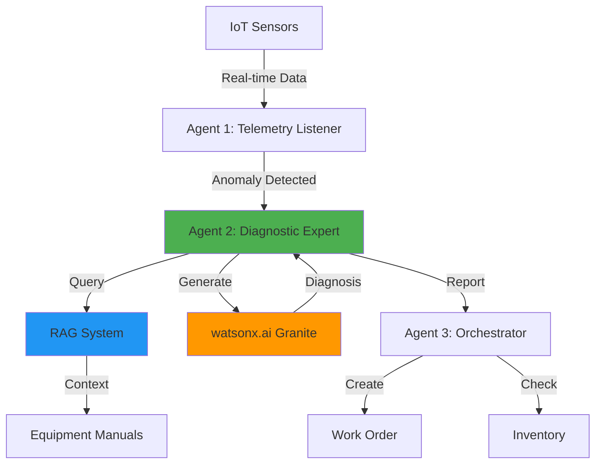

# SyncOpsAI — AI-Powered Equipment Monitoring

**IBM Hackathon POC** | Multi-Agent System | watsonx.ai | watsonx Orchestrate | RAG

## Overview

SyncOpsAI monitors manufacturing equipment in real time and automatically detects anomalies, diagnoses root causes, and generates maintenance work orders. Three specialized AI agents replace a manual process that previously took hours.

## How It Works



| Agent | Role |
|-------|------|
| **Agent 1 — Telemetry Listener** | Monitors sensor data, detects anomalies, classifies severity |
| **Agent 2 — Diagnostic Expert** | Queries equipment manuals via RAG, generates AI diagnosis using IBM Granite |
| **Agent 3 — Orchestrator** | Checks inventory, creates prioritized work order |

## Quick Start

```bash
# 1. Install dependencies
pip install -r requirements.txt

# 2. Configure environment
cp .env.example .env
# Add your WATSONX_API_KEY, WATSONX_URL, WATSONX_PROJECT_ID

# 3. Start the Mock API
python mock_apis/app.py
# Runs on http://localhost:8787

# 4. Run the dashboard
streamlit run dashboard/app.py
# Opens at http://localhost:8501
```

## Startup Commands

```bash
# Option 1: Start everything at once
cd dashboard && ./run_dashboard.sh

# Option 2: Start separately

# Terminal 1 — Mock API
cd mock_apis && python app.py

# Terminal 2 — Dashboard
cd dashboard && streamlit run app.py
```

## Project Structure

```
SyncOpsAI/
├── poc/                              # Core agent logic (POC)
│   ├── agents.py                     # Agent 1, 2, 3 implementations
│   ├── main.py                       # LangGraph workflow orchestration
│   ├── state.py                      # Shared state schema
│   ├── data.py                       # Demo scenarios & thresholds
│   ├── dashboard.py                  # POC Streamlit interface
│   ├── integration.py                # POC integration layer
│   └── requirements.txt
│
├── dashboard/                        # Production dashboard
│   ├── app.py                        # Streamlit app (4 tabs, live gauges)
│   ├── run_dashboard.sh              # One-command startup script
│   └── requirements.txt
│
├── mock_apis/                        # Mock REST API servers
│   ├── app.py                        # Main Flask API
│   ├── work_order_api.py             # Work order endpoints
│   ├── inventory_api.py              # Inventory endpoints
│   ├── technician_api.py             # Technician endpoints
│   ├── test_api.py                   # API tests
│   ├── start_all.sh                  # Start all API servers
│   └── stop_all.sh                   # Stop all API servers
│
├── orchestrate/                      # watsonx Orchestrate
│   ├── agents/
│   │   ├── telemetry_agent.yaml      # Agent 1 config
│   │   ├── diagnostic_agent.yaml     # Agent 2 config
│   │   └── orchestrator_agent.yaml   # Agent 3 config
│   ├── tools/
│   │   ├── detect_anomaly.py         # Anomaly detection tool
│   │   ├── generate_diagnosis.py     # Diagnosis generation tool
│   │   ├── create_work_order.py      # Work order tool
│   │   └── check_inventory.py        # Inventory check tool
│   └── import-all.sh                 # Deploy all agents & tools
│
├── tools/                            # watsonx Orchestrate tool YAMLs
│   ├── work_order_api.yaml
│   ├── inventory_api.yaml
│   └── technician_api.yaml
│
├── bob_sessions/                     # IBM Bob session logs
│
├── logs/                             # API runtime logs
│
├── data.py                           # Sensor data scenarios
├── manuals.py                        # Equipment manual knowledge base
├── rag.py                            # RAG system
├── diagnosis.py                      # Diagnostic engine
├── agents.py                         # Root-level agent workflow
├── watsonx_integration.py            # watsonx.ai Granite wrapper
├── watson_orchestrate_integration.py # watsonx Orchestrate wrapper
├── pinecone_integration.py           # Pinecone vector DB integration
├── verify_ai_config.py               # AI configuration checker
├── workspace_config.yaml             # Workspace configuration
└── requirements.txt                  # Root dependencies
```

## Demo Scenarios

### HVAC Overheating
- **Equipment**: HVAC-001
- **Signal**: Temperature 22°C → 32°C (threshold: 28°C)
- **AI Diagnosis**: Clogged air filter restricting airflow (92% confidence)
- **Parts**: AF-2024 — $45, 30 min repair
- **Result**: Work order created automatically in <5s

### Motor Vibration
- **Equipment**: MOTOR-001
- **Signal**: Vibration 1.2 → 4.5 Hz (threshold: 3.5 Hz)
- **AI Diagnosis**: Worn roller bearings (88% confidence)
- **Parts**: RB-500 + AS-KIT — $310, 2–3 hrs repair
- **Result**: Work order created automatically in <5s

## Tech Stack

| Layer | Technology |
|-------|-----------|
| AI Diagnosis | IBM watsonx.ai — Granite-13B-Chat-v2 |
| Agent Orchestration | IBM watsonx Orchestrate |
| Development Assistant | IBM Bob |
| Workflow Graph | LangGraph |
| Vector DB | Pinecone (production) |
| UI | Streamlit + Plotly |
| API | Flask |
| Language | Python 3.9+ |

## IBM Technology Usage

**IBM Bob** — Used throughout development for architecture planning, parallel workstream design, and code generation across all modules.

**IBM watsonx.ai** — Powers Agent 2. Builds a prompt from sensor readings and RAG-retrieved manual context, calls Granite-13B-Chat-v2, and returns a structured JSON diagnosis with root cause, confidence score, and recommended actions. Falls back to template-based diagnosis if unavailable.

**IBM watsonx Orchestrate** — Three agent YAML configurations and four `@tool`-decorated Python functions are implemented and ready for deployment. Live connection is the immediate next step — no structural changes required.

## Performance

| Metric | Value |
|--------|-------|
| Anomaly detection | <1ms |
| AI diagnosis | 2–5s |
| End-to-end (anomaly → work order) | <5s |
| Confidence score (AI mode) | 85–95% |
| Diagnosis time vs manual | 95% faster |

## Status

| Component | Status |
|-----------|--------|
| Multi-agent workflow | ✅ Complete |
| watsonx.ai integration | ✅ Complete |
| RAG system | ✅ Complete |
| Mock API (10 endpoints) | ✅ Complete |
| Streamlit dashboard | ✅ Complete |
| watsonx Orchestrate structure | ✅ Complete |
| Pinecone integration | 🏭 Production |
| Live Orchestrate connection | 🏭 Production |

---

*Built for IBM Hackathon — Team Manual-Miners*