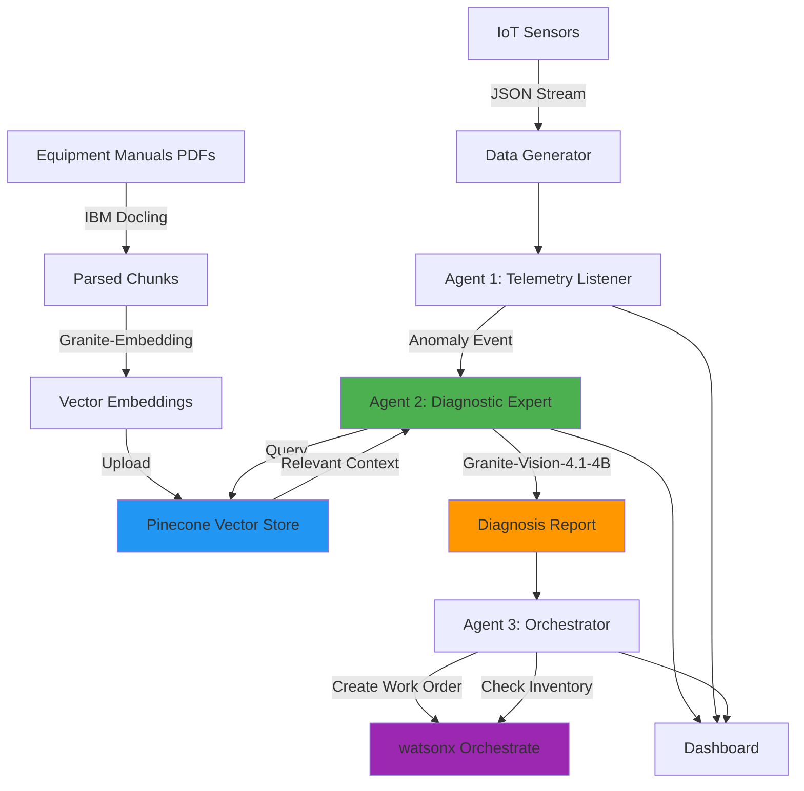

# Developer A: Backend & AI Infrastructure Plan
## 2-Day Hackathon Implementation Guide

---

## AGENT COMMUNICATION ARCHITECTURE

### LangGraph Message Passing System

**Core Concept:** Agents communicate through a shared state graph managed by LangGraph. Each agent is a node that receives state, processes it, and returns updated state.

#### State Schema Definition
```python
from typing import TypedDict, Annotated, Sequence
from langgraph.graph import StateGraph, END
import operator

class AgentState(TypedDict):
    """Shared state passed between agents"""
    # Input data
    sensor_data: dict
    equipment_id: str
    timestamp: str
    
    # Agent 1 outputs
    anomaly_detected: bool
    anomaly_type: str
    anomaly_severity: str
    
    # Agent 2 outputs
    diagnosis_complete: bool
    root_cause: str
    resolution_steps: list[str]
    required_parts: list[dict]
    rag_context: list[dict]
    
    # Agent 3 outputs
    work_order_created: bool
    work_order_id: str
    inventory_checked: bool
    parts_available: bool
    
    # Metadata
    messages: Annotated[Sequence[str], operator.add]
    errors: list[str]
```

#### Agent Node Implementation Pattern

**Agent 1: Telemetry Listener**
```python
def agent_1_telemetry(state: AgentState) -> AgentState:
    """
    Receives sensor data, detects anomalies, updates state.
    """
    sensor_data = state["sensor_data"]
    equipment_id = state["equipment_id"]
    
    # Anomaly detection logic
    anomaly_detected, anomaly_type, severity = detect_anomaly(sensor_data)
    
    # Update state
    return {
        **state,
        "anomaly_detected": anomaly_detected,
        "anomaly_type": anomaly_type,
        "anomaly_severity": severity,
        "messages": [f"Agent 1: Anomaly detected - {anomaly_type}"]
    }
```

**Agent 2: Diagnostic Expert (Developer A's Focus)**
```python
def agent_2_diagnostic(state: AgentState) -> AgentState:
    """
    Receives anomaly info, queries RAG, generates diagnosis.
    """
    if not state["anomaly_detected"]:
        return state
    
    # Query RAG system (Developer A's function)
    rag_results = query_equipment_manual(
        equipment_id=state["equipment_id"],
        anomaly_type=state["anomaly_type"],
        sensor_data=state["sensor_data"]
    )
    
    # Generate diagnosis with LLM
    diagnosis = diagnose_equipment_issue({
        "equipment_id": state["equipment_id"],
        "anomaly_type": state["anomaly_type"],
        "sensor_data": state["sensor_data"],
        "rag_context": rag_results
    })
    
    # Update state
    return {
        **state,
        "diagnosis_complete": True,
        "root_cause": diagnosis["root_cause"],
        "resolution_steps": diagnosis["resolution_steps"],
        "required_parts": diagnosis["required_parts"],
        "rag_context": rag_results["relevant_sections"],
        "messages": [f"Agent 2: Diagnosis complete - {diagnosis['root_cause']}"]
    }
```

**Agent 3: Orchestrator**
```python
def agent_3_orchestrator(state: AgentState) -> AgentState:
    """
    Receives diagnosis, creates work order, checks inventory.
    """
    if not state["diagnosis_complete"]:
        return state
    
    # Create work order via watsonx Orchestrate
    work_order = create_work_order({
        "equipment_id": state["equipment_id"],
        "issue": state["root_cause"],
        "steps": state["resolution_steps"],
        "parts": state["required_parts"]
    })
    
    # Check inventory
    inventory_status = check_inventory(state["required_parts"])
    
    # Update state
    return {
        **state,
        "work_order_created": True,
        "work_order_id": work_order["id"],
        "inventory_checked": True,
        "parts_available": inventory_status["all_available"],
        "messages": [f"Agent 3: Work order {work_order['id']} created"]
    }
```

#### Graph Construction

```python
from langgraph.graph import StateGraph, END

# Create graph
workflow = StateGraph(AgentState)

# Add nodes (agents)
workflow.add_node("telemetry", agent_1_telemetry)
workflow.add_node("diagnostic", agent_2_diagnostic)
workflow.add_node("orchestrator", agent_3_orchestrator)

# Define routing logic
def should_diagnose(state: AgentState) -> str:
    """Route to diagnostic if anomaly detected"""
    if state["anomaly_detected"]:
        return "diagnostic"
    return END

def should_orchestrate(state: AgentState) -> str:
    """Route to orchestrator if diagnosis complete"""
    if state["diagnosis_complete"]:
        return "orchestrator"
    return END

# Add edges (message flow)
workflow.set_entry_point("telemetry")
workflow.add_conditional_edges(
    "telemetry",
    should_diagnose,
    {
        "diagnostic": "diagnostic",
        END: END
    }
)
workflow.add_conditional_edges(
    "diagnostic",
    should_orchestrate,
    {
        "orchestrator": "orchestrator",
        END: END
    }
)
workflow.add_edge("orchestrator", END)

# Compile graph
app = workflow.compile()
```

#### Sending Messages to Agents

**Method 1: Direct Invocation (Synchronous)**
```python
# Initialize state
initial_state = {
    "sensor_data": {
        "temperature": 32.5,
        "pressure": 50,
        "current": 11
    },
    "equipment_id": "HVAC-001",
    "timestamp": "2026-05-01T10:30:00Z",
    "anomaly_detected": False,
    "diagnosis_complete": False,
    "work_order_created": False,
    "messages": [],
    "errors": []
}

# Run workflow
result = app.invoke(initial_state)

# Access results
print(result["work_order_id"])
print(result["messages"])
```

**Method 2: Streaming (Real-time Updates)**
```python
# Stream workflow execution
for state in app.stream(initial_state):
    # state contains updates after each agent
    print(f"Current agent: {state}")
    print(f"Messages: {state['messages']}")
    
    # Update dashboard in real-time
    update_dashboard(state)
```

**Method 3: Async Processing (Non-blocking)**
```python
import asyncio

async def process_sensor_stream():
    """Process multiple sensor readings concurrently"""
    sensor_readings = get_sensor_stream()
    
    tasks = []
    for reading in sensor_readings:
        state = create_initial_state(reading)
        task = asyncio.create_task(app.ainvoke(state))
        tasks.append(task)
    
    results = await asyncio.gather(*tasks)
    return results

# Run async
results = asyncio.run(process_sensor_stream())
```

#### Message Passing Between Agents

**Key Principles:**
1. **Immutable State Updates:** Each agent returns a new state dict
2. **Conditional Routing:** Graph decides which agent runs next based on state
3. **Message Accumulation:** Use `Annotated[Sequence, operator.add]` for logs
4. **Error Handling:** Agents can add errors to state without breaking flow

**Example: Agent 2 Sending Data to Agent 3**
```python
# Agent 2 completes diagnosis
def agent_2_diagnostic(state: AgentState) -> AgentState:
    diagnosis = generate_diagnosis(state)
    
    # Prepare data for Agent 3
    return {
        **state,
        "diagnosis_complete": True,  # Triggers routing to Agent 3
        "root_cause": diagnosis["root_cause"],
        "resolution_steps": diagnosis["resolution_steps"],
        "required_parts": diagnosis["required_parts"],
        "messages": ["Agent 2: Diagnosis ready for orchestration"]
    }

# Graph automatically routes to Agent 3 when diagnosis_complete=True
# Agent 3 receives the updated state
def agent_3_orchestrator(state: AgentState) -> AgentState:
    # Access data from Agent 2
    parts = state["required_parts"]
    steps = state["resolution_steps"]
    
    # Process and update state
    work_order = create_work_order(parts, steps)
    return {**state, "work_order_id": work_order["id"]}
```

#### Developer A's Integration Points

**1. RAG Query Function Interface**
```python
# This function is called BY Agent 2
# Developer B will integrate it into the agent node
def query_equipment_manual(
    equipment_id: str,
    anomaly_type: str,
    sensor_data: dict
) -> dict:
    """
    Called by Agent 2 during diagnosis.
    Returns RAG context for LLM.
    """
    # Your implementation here
    pass
```

**2. Diagnosis Function Interface**
```python
# This function is also called BY Agent 2
# It uses RAG results to generate diagnosis
def diagnose_equipment_issue(anomaly_event: dict) -> dict:
    """
    Called by Agent 2 after RAG query.
    Returns structured diagnosis.
    """
    # Your implementation here
    pass
```

**3. State Access Pattern**
```python
# Agent 2 receives state from Agent 1
def agent_2_diagnostic(state: AgentState) -> AgentState:
    # Read from state (sent by Agent 1)
    equipment_id = state["equipment_id"]
    anomaly_type = state["anomaly_type"]
    sensor_data = state["sensor_data"]
    
    # Call Developer A's functions
    rag_results = query_equipment_manual(equipment_id, anomaly_type, sensor_data)
    diagnosis = diagnose_equipment_issue({...})
    
    # Write to state (for Agent 3)
    return {
        **state,
        "diagnosis_complete": True,
        "root_cause": diagnosis["root_cause"],
        # ... other fields
    }
```

#### Testing Agent Communication

```python
# Test individual agents
def test_agent_2():
    mock_state = {
        "equipment_id": "HVAC-001",
        "anomaly_type": "overheating",
        "sensor_data": {"temperature": 32.5},
        "anomaly_detected": True,
        "messages": []
    }
    
    result = agent_2_diagnostic(mock_state)
    
    assert result["diagnosis_complete"] == True
    assert "root_cause" in result
    assert len(result["resolution_steps"]) > 0

# Test full workflow
def test_full_workflow():
    initial_state = create_test_state()
    final_state = app.invoke(initial_state)
    
    assert final_state["work_order_created"] == True
    assert len(final_state["messages"]) == 3  # One per agent
```

---

## Overview
**Role:** Backend & AI Infrastructure Developer  
**Focus Areas:** Data pipeline, RAG system, watsonx.ai integration  
**Key Technologies:** Python, LangGraph, Pinecone, watsonx.ai, IBM Docling, Granite models

---

## DAY 1: FOUNDATION BUILD

### Morning Session (4 hours) - Data Generation & Preparation

#### Task 1: Environment Setup (45 minutes)
**Objective:** Configure Python environment with all required dependencies

**Required Packages:**
```python
# requirements.txt
langgraph>=0.2.0
pinecone-client>=3.0.0
ibm-watsonx-ai>=0.2.0
docling>=1.0.0
pandas>=2.0.0
numpy>=1.24.0
python-dotenv>=1.0.0
faker>=20.0.0
reportlab>=4.0.0  # For PDF generation
```

**Environment Variables:**
```bash
WATSONX_API_KEY=<your_key>
WATSONX_PROJECT_ID=<your_project_id>
PINECONE_API_KEY=<your_key>
PINECONE_ENVIRONMENT=<your_env>
```

**Deliverable:** Working Python environment with all dependencies installed

---

#### Task 2: Synthetic IoT Sensor Data Generator (1.5 hours)
**Objective:** Create realistic IoT sensor data with normal and anomaly patterns

**Data Schema:**
```json
{
  "equipment_id": "string (e.g., HVAC-001, MOTOR-002)",
  "equipment_type": "string (HVAC or conveyor_motor)",
  "sensor_type": "string (temperature, vibration, pressure, current)",
  "value": "float",
  "unit": "string (°C, Hz, PSI, A)",
  "timestamp": "ISO 8601 datetime",
  "is_anomaly": "boolean",
  "anomaly_type": "string (null, overheating, excessive_vibration, pressure_drop)"
}
```

**Equipment Types & Sensors:**

1. **HVAC System (2 units: HVAC-001, HVAC-002)**
   - Temperature sensor: Normal 18-24°C, Anomaly >28°C
   - Pressure sensor: Normal 40-60 PSI, Anomaly <35 PSI
   - Current sensor: Normal 8-12A, Anomaly >15A

2. **Conveyor Motor (2 units: MOTOR-001, MOTOR-002)**
   - Vibration sensor: Normal 0.5-2.0 Hz, Anomaly >3.5 Hz
   - Temperature sensor: Normal 40-60°C, Anomaly >75°C
   - Current sensor: Normal 15-25A, Anomaly >30A

**Implementation Requirements:**
- Generate data at 1-minute intervals
- 10% anomaly rate (realistic for demo)
- Anomalies should cluster (3-5 consecutive readings)
- Include metadata: location, installation_date, last_maintenance

**File Structure:**
```
data_generator.py
├── generate_normal_reading()
├── generate_anomaly_reading()
├── create_data_stream()
└── export_to_json()
```

**Deliverable:** `data_generator.py` + sample dataset (1000+ records)

---

#### Task 3: Generate Synthetic Equipment Manuals (1.75 hours)
**Objective:** Create 2 realistic PDF manuals with troubleshooting information

**Manual 1: HVAC System Maintenance Guide (12-15 pages)**

**Required Sections:**
1. **Equipment Overview** (1 page)
   - Model specifications
   - Component diagram
   - Installation date and warranty info

2. **Sensor Specifications** (2 pages)
   - Temperature sensor: Range, accuracy, calibration
   - Pressure sensor: Normal operating range
   - Current sensor: Expected load patterns

3. **Normal Operating Parameters** (1 page)
   - Temperature: 18-24°C optimal
   - Pressure: 45-55 PSI standard
   - Current draw: 8-12A typical

4. **Troubleshooting Guide** (4-5 pages)
   - **High Temperature Alert (>28°C)**
     - Possible causes: Clogged air filter, refrigerant leak, compressor failure
     - Resolution steps: Check filter, inspect refrigerant lines, test compressor
     - Required parts: Air filter (P/N: AF-2024), refrigerant R-410A
   
   - **Low Pressure Alert (<35 PSI)**
     - Possible causes: Duct leak, damper malfunction, blower motor issue
     - Resolution steps: Inspect ductwork, check dampers, test blower
     - Required parts: Duct sealant, damper actuator (P/N: DA-150)
   
   - **High Current Draw (>15A)**
     - Possible causes: Bearing wear, electrical short, capacitor failure
     - Resolution steps: Check bearings, inspect wiring, test capacitor
     - Required parts: Motor bearings (P/N: MB-300), start capacitor (P/N: SC-45)

5. **Parts List** (2 pages)
   - Part numbers, descriptions, suppliers
   - Recommended spare parts inventory

6. **Maintenance Schedule** (1 page)
   - Monthly, quarterly, annual tasks

**Manual 2: Conveyor Motor Maintenance Guide (12-15 pages)**

**Required Sections:**
1. **Equipment Overview** (1 page)
2. **Sensor Specifications** (2 pages)
   - Vibration sensor: Normal 0.5-2.0 Hz
   - Temperature sensor: Normal 40-60°C
   - Current sensor: Normal 15-25A

3. **Normal Operating Parameters** (1 page)
4. **Troubleshooting Guide** (4-5 pages)
   - **Excessive Vibration (>3.5 Hz)**
     - Possible causes: Bearing wear, misalignment, imbalanced load
     - Resolution steps: Inspect bearings, check alignment, balance load
     - Required parts: Roller bearings (P/N: RB-500), alignment shims
   
   - **Motor Overheating (>75°C)**
     - Possible causes: Overload, poor ventilation, winding failure
     - Resolution steps: Check load, clean vents, test windings
     - Required parts: Cooling fan (P/N: CF-200), thermal paste
   
   - **High Current Draw (>30A)**
     - Possible causes: Mechanical binding, phase imbalance, insulation breakdown
     - Resolution steps: Check for obstructions, test phases, inspect insulation
     - Required parts: Motor contactor (P/N: MC-75), insulation tape

5. **Parts List** (2 pages)
6. **Maintenance Schedule** (1 page)

**Implementation Approach:**
- Use ReportLab or similar library for PDF generation
- Include realistic technical language
- Add simple diagrams (optional but helpful)
- Ensure troubleshooting sections are detailed enough for RAG retrieval

**File Structure:**
```
manual_generator.py
├── create_hvac_manual()
├── create_motor_manual()
├── add_troubleshooting_section()
└── generate_pdf()
```

**Deliverable:** 
- `manual_generator.py`
- `HVAC_Maintenance_Manual.pdf`
- `Conveyor_Motor_Maintenance_Manual.pdf`

---

### Afternoon Session (4 hours) - RAG System Implementation

#### Task 4: Parse PDFs with IBM Docling (1 hour)
**Objective:** Extract and chunk manual content with layout awareness

**Implementation Requirements:**
- Use IBM Docling for layout-aware parsing
- Preserve document structure (headers, sections, tables)
- Create semantic chunks (200-500 tokens each)
- Maintain metadata: page number, section title, equipment type

**Chunking Strategy:**
```python
# Chunk by semantic sections
chunks = [
    {
        "content": "text content",
        "metadata": {
            "equipment_type": "HVAC",
            "section": "Troubleshooting",
            "page": 7,
            "subsection": "High Temperature Alert",
            "chunk_id": "HVAC_TROUBLE_TEMP_001"
        }
    }
]
```

**File Structure:**
```
rag_setup.py
├── parse_pdf_with_docling()
├── create_semantic_chunks()
├── extract_metadata()
└── validate_chunks()
```

**Deliverable:** Parsed and chunked manual content (JSON format)

---

#### Task 5: Embed Chunks with Granite-Embedding (1 hour)
**Objective:** Generate embeddings using watsonx.ai Granite model

**Model Configuration:**
```python
from ibm_watsonx_ai.foundation_models import Embeddings

embeddings = Embeddings(
    model_id="ibm/granite-embedding-125m-english",
    credentials={
        "apikey": WATSONX_API_KEY,
        "url": "https://us-south.ml.cloud.ibm.com"
    },
    project_id=WATSONX_PROJECT_ID
)
```

**Implementation Requirements:**
- Batch process chunks (10-20 at a time)
- Handle rate limiting gracefully
- Store embeddings with original metadata
- Validate embedding dimensions (768 for Granite-Embedding)

**Error Handling:**
- Retry logic for API failures
- Fallback for oversized chunks
- Logging for debugging

**Deliverable:** Embedded chunks ready for vector store upload

---

#### Task 6: Configure Pinecone Vector Store (1 hour)
**Objective:** Set up Pinecone index and upload embeddings

**Index Configuration:**
```python
import pinecone

pinecone.init(
    api_key=PINECONE_API_KEY,
    environment=PINECONE_ENVIRONMENT
)

# Create index
index_name = "equipment-manuals"
pinecone.create_index(
    name=index_name,
    dimension=768,  # Granite-Embedding dimension
    metric="cosine",
    metadata_config={
        "indexed": ["equipment_type", "section", "anomaly_type"]
    }
)
```

**Metadata Schema:**
```python
{
    "equipment_type": "HVAC",
    "section": "Troubleshooting",
    "anomaly_type": "overheating",
    "page": 7,
    "chunk_id": "HVAC_TROUBLE_TEMP_001",
    "required_parts": ["AF-2024", "R-410A"]
}
```

**Upload Strategy:**
- Batch upsert (100 vectors at a time)
- Include rich metadata for filtering
- Verify upload success
- Create backup of vector IDs

**Deliverable:** Populated Pinecone index with all manual embeddings

---

#### Task 7: Create RAG Query Function (1 hour)
**Objective:** Build retrieval function for Agent 2 integration

**Function Signature:**
```python
def query_equipment_manual(
    equipment_id: str,
    anomaly_type: str,
    sensor_data: dict,
    top_k: int = 5
) -> dict:
    """
    Query equipment manual for troubleshooting information.
    
    Args:
        equipment_id: Equipment identifier (e.g., "HVAC-001")
        anomaly_type: Type of anomaly detected (e.g., "overheating")
        sensor_data: Current sensor readings
        top_k: Number of relevant chunks to retrieve
    
    Returns:
        {
            "relevant_sections": [
                {
                    "content": "troubleshooting text",
                    "metadata": {...},
                    "relevance_score": 0.95
                }
            ],
            "required_parts": ["P/N: AF-2024", "P/N: R-410A"],
            "resolution_steps": ["Step 1", "Step 2", ...],
            "equipment_type": "HVAC"
        }
    """
```

**Query Construction:**
```python
# Build query from anomaly context
query_text = f"""
Equipment: {equipment_id}
Anomaly: {anomaly_type}
Current readings: {sensor_data}
What are the troubleshooting steps and required parts?
"""

# Embed query
query_embedding = embeddings.embed_query(query_text)

# Search with metadata filtering
results = index.query(
    vector=query_embedding,
    top_k=top_k,
    filter={
        "equipment_type": equipment_type,
        "section": "Troubleshooting"
    },
    include_metadata=True
)
```

**Post-Processing:**
- Extract required parts from retrieved chunks
- Rank resolution steps by relevance
- Format output for Agent 2 consumption
- Include confidence scores

**Testing:**
```python
# Test cases
test_queries = [
    {
        "equipment_id": "HVAC-001",
        "anomaly_type": "overheating",
        "sensor_data": {"temperature": 32.5, "pressure": 50}
    },
    {
        "equipment_id": "MOTOR-001",
        "anomaly_type": "excessive_vibration",
        "sensor_data": {"vibration": 4.2, "temperature": 65}
    }
]
```

**Deliverable:** 
- `rag_query.py` with query function
- Test results showing retrieval accuracy
- Documentation for Developer B integration

---

### End of Day 1 Handoff

**Deliverables to Share with Developer B:**
1. Pinecone index details:
   - Index name: `equipment-manuals`
   - Dimension: 768
   - Metric: cosine

2. RAG query function interface:
   ```python
   from rag_query import query_equipment_manual
   
   result = query_equipment_manual(
       equipment_id="HVAC-001",
       anomaly_type="overheating",
       sensor_data={"temperature": 32.5}
   )
   ```

3. Sample query results for testing

4. Equipment data schema and sample dataset

**Communication Points:**
- Confirm Agent 2 input/output format
- Discuss error handling strategy
- Align on metadata structure
- Schedule Day 2 morning sync

---

## DAY 2: AI INTEGRATION & TESTING

### Morning Session (3 hours) - Agent 2 Integration

#### Task 8: Integrate Granite-Vision-4.1-4B (1.5 hours)
**Objective:** Add LLM-powered diagnosis to Agent 2

**Model Configuration:**
```python
from ibm_watsonx_ai.foundation_models import ModelInference

model = ModelInference(
    model_id="ibm/granite-vision-4.1-4b",
    credentials={
        "apikey": WATSONX_API_KEY,
        "url": "https://us-south.ml.cloud.ibm.com"
    },
    project_id=WATSONX_PROJECT_ID,
    params={
        "max_new_tokens": 500,
        "temperature": 0.3,
        "top_p": 0.9
    }
)
```

**Prompt Template:**
```python
DIAGNOSIS_PROMPT = """
You are an expert equipment maintenance technician analyzing sensor data and equipment manuals.

EQUIPMENT INFORMATION:
- Equipment ID: {equipment_id}
- Equipment Type: {equipment_type}
- Anomaly Detected: {anomaly_type}

CURRENT SENSOR READINGS:
{sensor_data}

RELEVANT MANUAL SECTIONS:
{rag_context}

TASK:
Analyze the sensor data and manual information to provide:
1. Root cause analysis
2. Step-by-step resolution procedure
3. Required parts with part numbers
4. Estimated repair time
5. Safety precautions

Respond in JSON format:
{{
    "root_cause": "detailed explanation",
    "resolution_steps": ["step 1", "step 2", ...],
    "required_parts": [
        {{"part_number": "P/N", "description": "...", "quantity": 1}}
    ],
    "estimated_time": "2 hours",
    "safety_precautions": ["precaution 1", ...],
    "confidence_score": 0.95
}}
"""
```

**Implementation:**
```python
def diagnose_equipment_issue(anomaly_event: dict) -> dict:
    """
    Generate diagnosis using RAG + LLM.
    
    Args:
        anomaly_event: {
            "equipment_id": "HVAC-001",
            "anomaly_type": "overheating",
            "sensor_data": {...},
            "timestamp": "..."
        }
    
    Returns:
        Diagnosis report with resolution steps
    """
    # Step 1: Query RAG system
    rag_results = query_equipment_manual(
        equipment_id=anomaly_event["equipment_id"],
        anomaly_type=anomaly_event["anomaly_type"],
        sensor_data=anomaly_event["sensor_data"]
    )
    
    # Step 2: Format prompt
    prompt = DIAGNOSIS_PROMPT.format(
        equipment_id=anomaly_event["equipment_id"],
        equipment_type=rag_results["equipment_type"],
        anomaly_type=anomaly_event["anomaly_type"],
        sensor_data=json.dumps(anomaly_event["sensor_data"], indent=2),
        rag_context=format_rag_context(rag_results)
    )
    
    # Step 3: Generate diagnosis
    response = model.generate(prompt)
    diagnosis = parse_llm_response(response)
    
    # Step 4: Validate and enrich
    diagnosis["rag_sources"] = rag_results["relevant_sections"]
    diagnosis["timestamp"] = datetime.now().isoformat()
    
    return diagnosis
```

**Error Handling:**
- Validate JSON output from LLM
- Fallback to RAG-only response if LLM fails
- Log all API calls for debugging

**Deliverable:** Complete Agent 2 with watsonx.ai integration

---

#### Task 9: Test RAG Retrieval Accuracy (1 hour)
**Objective:** Validate end-to-end diagnosis quality

**Test Scenarios:**

1. **HVAC Overheating**
   ```python
   test_case_1 = {
       "equipment_id": "HVAC-001",
       "anomaly_type": "overheating",
       "sensor_data": {
           "temperature": 32.5,
           "pressure": 50,
           "current": 11
       }
   }
   ```
   **Expected Output:**
   - Root cause: Clogged air filter or refrigerant leak
   - Parts: AF-2024, R-410A
   - Steps: Check filter, inspect refrigerant lines

2. **Motor Excessive Vibration**
   ```python
   test_case_2 = {
       "equipment_id": "MOTOR-001",
       "anomaly_type": "excessive_vibration",
       "sensor_data": {
           "vibration": 4.2,
           "temperature": 65,
           "current": 22
       }
   }
   ```
   **Expected Output:**
   - Root cause: Bearing wear or misalignment
   - Parts: RB-500, alignment shims
   - Steps: Inspect bearings, check alignment

**Validation Metrics:**
- Retrieval precision: Are retrieved chunks relevant?
- Diagnosis accuracy: Does root cause match manual?
- Part number extraction: Are all required parts identified?
- Response time: <5 seconds end-to-end

**Fine-Tuning:**
- Adjust chunk size if retrieval is poor
- Modify metadata filters for better precision
- Tune LLM temperature for consistency

**Deliverable:** Test report with accuracy metrics and sample outputs

---

#### Task 10: Fine-Tune System (30 minutes)
**Objective:** Optimize based on test results

**Potential Adjustments:**
- Chunk size: Increase to 600 tokens if context is insufficient
- Top-k retrieval: Adjust from 5 to 3-7 based on precision
- Metadata filters: Add anomaly_type indexing if needed
- Prompt engineering: Refine for better JSON output

**Deliverable:** Optimized RAG system ready for integration

---

### Afternoon Session (5 hours) - Integration & Demo

#### Task 11: End-to-End Integration Testing (2 hours)
**Objective:** Test full workflow with Developer B

**Integration Points:**
1. Agent 1 (Telemetry) → Agent 2 (Diagnostic)
   - Verify anomaly event format
   - Test error handling

2. Agent 2 (Diagnostic) → Agent 3 (Orchestrator)
   - Verify diagnosis report format
   - Test watsonx Orchestrate API calls

**Test Workflow:**
```
Synthetic Data → Agent 1 detects anomaly → 
Agent 2 queries RAG + generates diagnosis → 
Agent 3 creates work order + checks inventory
```

**Debug Checklist:**
- [ ] Data flows correctly between agents
- [ ] RAG retrieval returns relevant results
- [ ] LLM generates valid JSON
- [ ] Work orders are created successfully
- [ ] Error handling works for all failure modes

**Deliverable:** Fully integrated multi-agent system

---

#### Task 12: Build Dashboard/Log Viewer (1.5 hours)
**Objective:** Create real-time visualization of agent actions

**Dashboard Requirements:**

**Components:**
1. **Sensor Data Stream** (top panel)
   - Real-time display of sensor readings
   - Color-coded by equipment type
   - Highlight anomalies in red

2. **Agent Activity Log** (middle panel)
   - Agent 1: "Anomaly detected: HVAC-001 overheating"
   - Agent 2: "Diagnosis complete: Clogged air filter"
   - Agent 3: "Work order created: WO-12345"

3. **Diagnosis Details** (bottom panel)
   - Root cause
   - Resolution steps
   - Required parts
   - RAG sources used

**Technology Stack:**
- Streamlit or Gradio for quick UI
- WebSocket for real-time updates (optional)
- Simple HTML/CSS/JS alternative

**Implementation:**
```python
import streamlit as st

st.title("SyncOpsAI - Equipment Monitoring Dashboard")

# Sensor data display
st.subheader("Live Sensor Data")
sensor_df = get_latest_sensor_data()
st.dataframe(sensor_df, use_container_width=True)

# Agent activity log
st.subheader("Agent Activity")
for event in get_agent_events():
    st.write(f"[{event['timestamp']}] {event['agent']}: {event['message']}")

# Diagnosis details
if st.session_state.get('latest_diagnosis'):
    st.subheader("Latest Diagnosis")
    st.json(st.session_state.latest_diagnosis)
```

**Deliverable:** Working dashboard showing real-time agent actions

---

#### Task 13: Demo Preparation (1.5 hours)
**Objective:** Prepare 2 demo scenarios with Developer B

**Scenario 1: HVAC Overheating**
```python
demo_scenario_1 = {
    "equipment_id": "HVAC-001",
    "timeline": [
        {"time": "00:00", "temp": 22, "status": "normal"},
        {"time": "00:05", "temp": 26, "status": "warning"},
        {"time": "00:10", "temp": 30, "status": "anomaly"},
        {"time": "00:15", "temp": 32, "status": "critical"}
    ],
    "expected_diagnosis": "Clogged air filter",
    "expected_parts": ["AF-2024"],
    "expected_work_order": "Replace air filter"
}
```

**Scenario 2: Motor Vibration**
```python
demo_scenario_2 = {
    "equipment_id": "MOTOR-001",
    "timeline": [
        {"time": "00:00", "vibration": 1.5, "status": "normal"},
        {"time": "00:05", "vibration": 2.8, "status": "warning"},
        {"time": "00:10", "vibration": 4.0, "status": "anomaly"},
        {"time": "00:15", "vibration": 4.5, "status": "critical"}
    ],
    "expected_diagnosis": "Bearing wear",
    "expected_parts": ["RB-500"],
    "expected_work_order": "Replace roller bearings"
}
```

**Demo Script:**
1. Show dashboard with normal operations
2. Inject anomaly data
3. Watch Agent 1 detect anomaly
4. Show Agent 2 RAG retrieval and diagnosis
5. Display Agent 3 work order creation
6. Highlight key features: speed, accuracy, automation

**Deliverable:** Demo-ready system with scripted scenarios

---

## CRITICAL SUCCESS FACTORS

### Communication Protocol
- **Daily Sync:** Lunch meeting to align on interfaces
- **Slack/Discord:** Real-time updates on blockers
- **Code Reviews:** Quick reviews before integration
- **Documentation:** Keep README updated with setup instructions

### Risk Mitigation
1. **API Rate Limits:** Implement caching and retry logic
2. **Model Latency:** Set timeouts and fallback responses
3. **Data Quality:** Validate all inputs/outputs
4. **Integration Issues:** Test components independently first

### Time Management
- **Buffer Time:** Leave 30 minutes buffer in each session
- **Prioritization:** Core functionality > polish
- **Parallel Work:** Minimize blocking dependencies
- **Demo Focus:** Working demo > perfect code

---

## FINAL DELIVERABLES CHECKLIST

- [ ] `data_generator.py` - Synthetic IoT data generator
- [ ] `HVAC_Maintenance_Manual.pdf` - Equipment manual
- [ ] `Conveyor_Motor_Maintenance_Manual.pdf` - Equipment manual
- [ ] `rag_setup.py` - PDF parsing and embedding
- [ ] `rag_query.py` - RAG query function
- [ ] `agent_2_diagnostic.py` - Complete Agent 2 with watsonx.ai
- [ ] `dashboard.py` - Real-time monitoring dashboard
- [ ] `requirements.txt` - All dependencies
- [ ] `README.md` - Setup and demo instructions
- [ ] `.env.example` - Environment variable template
- [ ] Test results and accuracy metrics
- [ ] Demo scenarios and scripts

---

## ARCHITECTURE DIAGRAM



---

## HANDOFF DOCUMENTATION

### For Developer B Integration

**RAG Query Function Usage:**
```python
from rag_query import query_equipment_manual

# In Agent 2
def process_anomaly(anomaly_event):
    # Query RAG system
    rag_results = query_equipment_manual(
        equipment_id=anomaly_event["equipment_id"],
        anomaly_type=anomaly_event["anomaly_type"],
        sensor_data=anomaly_event["sensor_data"]
    )
    
    # Use results for diagnosis
    diagnosis = generate_diagnosis(anomaly_event, rag_results)
    return diagnosis
```

**Expected Input Format:**
```json
{
    "equipment_id": "HVAC-001",
    "anomaly_type": "overheating",
    "sensor_data": {
        "temperature": 32.5,
        "pressure": 50,
        "current": 11,
        "timestamp": "2026-05-01T10:30:00Z"
    }
}
```

**Expected Output Format:**
```json
{
    "root_cause": "Clogged air filter restricting airflow",
    "resolution_steps": [
        "Turn off HVAC system",
        "Remove and inspect air filter",
        "Replace filter if clogged (P/N: AF-2024)",
        "Check refrigerant levels",
        "Restart system and monitor temperature"
    ],
    "required_parts": [
        {
            "part_number": "AF-2024",
            "description": "High-efficiency air filter",
            "quantity": 1,
            "estimated_cost": "$45"
        }
    ],
    "estimated_time": "1 hour",
    "safety_precautions": [
        "Ensure power is disconnected",
        "Wear protective gloves"
    ],
    "confidence_score": 0.95,
    "rag_sources": [
        {
            "content": "High temperature alerts...",
            "page": 7,
            "relevance_score": 0.92
        }
    ]
}
```

---

## READY FOR EXECUTION

This plan provides a complete roadmap for Developer A's work over the 2-day hackathon. All tasks are sequenced logically with clear deliverables and integration points. The focus is on building a robust backend infrastructure that enables the multi-agent system to function effectively.

**Next Steps:**
1. Review plan with Developer B
2. Confirm API access and credentials
3. Set up development environment
4. Begin Day 1 Morning tasks

Good luck with the hackathon! 🚀