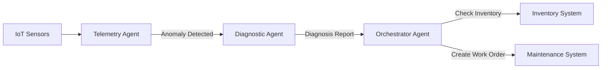

# SyncOpsAI - watsonx Orchestrate Integration

This directory contains the watsonx Orchestrate implementation of the SyncOpsAI multi-agent system for predictive equipment maintenance.

## 📁 Directory Structure

```
orchestrate/
├── agents/                      # Agent YAML configurations
│   ├── telemetry_agent.yaml    # Monitors IoT sensor data
│   ├── diagnostic_agent.yaml   # Analyzes anomalies and generates diagnoses
│   └── orchestrator_agent.yaml # Creates work orders and manages inventory
├── tools/                       # Python tools for agents
│   ├── detect_anomaly.py       # Anomaly detection from sensor data
│   ├── generate_diagnosis.py   # Diagnostic report generation
│   ├── create_work_order.py    # Work order creation
│   └── check_inventory.py      # Parts inventory checking
├── import-all.sh               # Import script for all components
└── README.md                   # This file
```

## 🤖 Agents

### 1. Telemetry Listener Agent (`telemetry_listener_agent`)
- **Purpose**: Monitors IoT sensor data and detects anomalies
- **Tools**: `detect_anomaly`
- **Collaborators**: `diagnostic_expert_agent`
- **Capabilities**:
  - Real-time sensor data monitoring
  - Threshold-based anomaly detection
  - Severity classification (normal, warning, critical)

### 2. Diagnostic Expert Agent (`diagnostic_expert_agent`)
- **Purpose**: Analyzes anomalies and generates diagnostic reports
- **Tools**: `generate_diagnosis`
- **Collaborators**: `orchestrator_agent`
- **Capabilities**:
  - Root cause analysis
  - Resolution step recommendations
  - Parts and cost estimation
  - Equipment manual references

### 3. Orchestrator Agent (`orchestrator_agent`)
- **Purpose**: Coordinates maintenance workflows
- **Tools**: `create_work_order`, `check_inventory`
- **Capabilities**:
  - Work order creation with priority assignment
  - Parts inventory verification
  - Maintenance team coordination
  - Completion time estimation

## 🛠️ Tools

### detect_anomaly
Analyzes IoT sensor data against equipment-specific thresholds.

**Input:**
- `equipment_id`: Equipment identifier (e.g., 'HVAC-001')
- `sensor_data`: Dictionary of sensor readings

**Output:**
- Anomaly detection result with type and severity

### generate_diagnosis
Generates comprehensive diagnostic reports using RAG and AI.

**Input:**
- `equipment_id`: Equipment identifier
- `anomaly_type`: Type of detected anomaly
- `sensor_data`: Current sensor readings

**Output:**
- Diagnostic report with root cause, resolution steps, and parts

### create_work_order
Creates maintenance work orders with proper scheduling.

**Input:**
- `equipment_id`: Equipment identifier
- `root_cause`: Identified issue
- `severity`: Severity level
- `resolution_steps`: Repair steps
- `required_parts`: Parts needed
- `estimated_cost`: Total cost

**Output:**
- Work order with ID, priority, and assignment

### check_inventory
Checks parts availability and delivery estimates.

**Input:**
- `required_parts`: List of parts with quantities

**Output:**
- Inventory status with availability and delivery times

## 🚀 Deployment

### Prerequisites

1. Install watsonx Orchestrate ADK:
```bash
pip install ibm-watsonx-orchestrate
```

2. Authenticate with watsonx Orchestrate:
```bash
orchestrate auth login
```

### Import All Components

Run the import script from the orchestrate directory:

```bash
cd orchestrate
./import-all.sh
```

This will import:
- 4 Python tools
- 3 native agents

### Manual Import (Alternative)

Import tools individually:
```bash
orchestrate tools import -k python -f tools/detect_anomaly.py
orchestrate tools import -k python -f tools/generate_diagnosis.py
orchestrate tools import -k python -f tools/create_work_order.py
orchestrate tools import -k python -f tools/check_inventory.py
```

Import agents:
```bash
orchestrate agents import -f agents/telemetry_agent.yaml
orchestrate agents import -f agents/diagnostic_agent.yaml
orchestrate agents import -f agents/orchestrator_agent.yaml
```

### Verify Deployment

```bash
# List all tools
orchestrate tools list

# List all agents
orchestrate agents list

# Get agent details
orchestrate agents get telemetry_listener_agent
```

## 🔄 Workflow



**Step-by-Step:**

1. **Telemetry Agent** monitors sensor data
   - Receives: Equipment ID + sensor readings
   - Uses: `detect_anomaly` tool
   - Output: Anomaly event (if detected)

2. **Diagnostic Agent** analyzes the anomaly
   - Receives: Anomaly event from Telemetry Agent
   - Uses: `generate_diagnosis` tool
   - Output: Diagnostic report with root cause and resolution

3. **Orchestrator Agent** coordinates maintenance
   - Receives: Diagnostic report from Diagnostic Agent
   - Uses: `check_inventory` + `create_work_order` tools
   - Output: Work order with parts status

## 📊 Example Usage

### Scenario: HVAC Overheating

**Input to Telemetry Agent:**
```json
{
  "equipment_id": "HVAC-001",
  "sensor_data": {
    "temperature": 88,
    "pressure": 42,
    "timestamp": "2024-01-15T10:30:00Z"
  }
}
```

**Telemetry Agent Output:**
```json
{
  "anomaly_detected": true,
  "anomaly_type": "overheating",
  "severity": "critical"
}
```

**Diagnostic Agent Output:**
```json
{
  "root_cause": "Clogged air filter restricting airflow",
  "resolution_steps": ["Turn off system", "Replace filter", "Check refrigerant"],
  "required_parts": [{"part_number": "FILTER-001", "quantity": 1}],
  "estimated_cost": "$45.00"
}
```

**Orchestrator Agent Output:**
```json
{
  "work_order_id": "WO-20240115103000",
  "priority": "Critical",
  "assigned_to": "HVAC Specialist Team",
  "estimated_completion_hours": 4,
  "parts_available": true
}
```

## 🔧 Configuration

### LLM Configuration
All agents use `watsonx/ibm/granite-3-8b-instruct` by default. To change:

1. Edit agent YAML files
2. Update the `llm` field
3. Re-import agents

### Tool Customization
To modify tool behavior:

1. Edit Python files in `tools/`
2. Update docstrings and logic
3. Re-import tools

## 📝 Notes

- **Memory**: Diagnostic and Orchestrator agents have memory enabled for context retention
- **Reasoning**: All agents show reasoning by default (can be hidden via `hide_reasoning: true`)
- **Restrictions**: All agents are editable after import
- **Icons**: Custom SVG icons included for visual identification

## 🔗 Integration with Existing System

This watsonx Orchestrate implementation complements the standalone Python system:

- **Standalone**: `agents.py` - Direct Python execution
- **Orchestrate**: This directory - Cloud-native, UI-enabled, collaborative agents

Both implementations share the same core logic but offer different deployment options.

## 📚 Resources

- [watsonx Orchestrate Documentation](https://developer.watson-orchestrate.ibm.com)
- [Agent Builder Guide](https://developer.watson-orchestrate.ibm.com/agents/build_agent)
- [Python Tools Guide](https://developer.watson-orchestrate.ibm.com/tools/create_tool)
- [ADK Installation](https://developer.watson-orchestrate.ibm.com/getting_started/installing)

## 🆘 Troubleshooting

**Import fails:**
- Verify authentication: `orchestrate auth status`
- Check file paths are correct
- Ensure Python syntax is valid

**Agent not working:**
- Verify tools are imported first
- Check agent YAML syntax
- Review agent logs in Orchestrate UI

**Tool errors:**
- Check Python dependencies
- Verify input schema matches
- Review tool docstrings

## 📄 License

Part of the SyncOpsAI project - Predictive Equipment Maintenance System